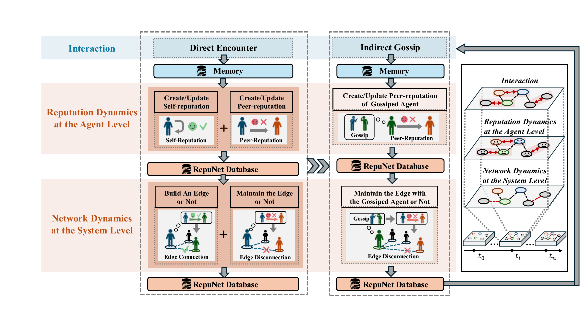

<div align="center">

# 🤝 RepuNet 仿真框架

**用声誉机制缓解 LLM 多智能体系统中的合作崩塌**

[](https://www.python.org/)
[](https://arxiv.org/abs/2505.05029)
[](#配置)
[](#许可证)

<a href="README.md"><kbd>English</kbd></a> <a href="README_ZH.md"><kbd>简体中文</kbd></a>

[论文](https://arxiv.org/abs/2505.05029) |
[HTML](https://arxiv.org/html/2505.05029v2) |
[架构图](#架构图) |
[快速开始](#快速开始) |
[引用](#引用)

</div>

## 简介

**RepuNet** 是一个用于研究 LLM 多智能体系统（MASs）中合作崩塌问题的仿真框架。它通过可运行的声誉系统探索如何缓解合作崩塌：智能体通过 OpenAI-compatible LLM 后端进行推理，根据直接交互和 gossip 更新自我/同伴声誉，动态重连社会网络，并在投资、报名和囚徒困境等场景中行动。

## 主要贡献

| 合作崩塌复现 | 可运行的声誉系统 | 涌现集体行为 |
| --- | --- | --- |
| 我们复现了 LLM-based MASs 中的合作崩塌现象，验证了其广泛存在，并强调解决该问题的必要性。 | 我们提出 **RepuNet**，这是首个将声誉机制泛化到 LLM-based MASs 的 operational reputation system。 | RepuNet 展现出涌现行为，说明声誉系统在驱动 LLM-based MASs 复杂集体行为中的关键作用。 |

## 架构图

<p align="center">
  
</p>

<p align="center">
  <em>RepuNet 声誉系统整体架构。</em><br>
  <a href="asset/Final_frameworkReputation_system.pdf">查看原始 PDF 架构图</a>
</p>

## 项目速览

| 项目 | 说明 |
| --- | --- |
| 仿真场景 | 投资、报名、囚徒困境 |
| 核心机制 | 声誉更新、gossip 传播、网络重连 |
| 智能体后端 | OpenAI-compatible LLM API |
| 状态管理 | 按 step 持久化到 `sim_storage/` |
| 主要入口 | `start.py`、`auto_run.py`、`scripts/run_simulation.py` |

## 目录

- [环境要求](#环境要求)
- [安装](#安装)
- [配置](#配置)
- [快速开始](#快速开始)
- [实验模式](#实验模式)
- [运行仿真](#运行仿真)
- [种子数据](#种子数据)
- [输出与常用路径](#输出与常用路径)
- [引用](#引用)
- [许可证](#许可证)

## 环境要求

- Python 3.13+
- 虚拟环境工具，例如 `uv`、`venv` 或 `conda`
- 可访问的 OpenAI-compatible API endpoint

## 安装

```bash
# 创建并激活虚拟环境。
uv venv
source .venv/bin/activate          # Windows: .venv\Scripts\activate

# 以 editable 模式安装 RepuNet。
uv pip install -e .
```

如果不使用 `uv`，也可以使用标准 Python 流程：

```bash
python -m venv .venv
source .venv/bin/activate
pip install -e .
```

## 配置

运行仿真前，请在 `utils.py` 中配置 LLM 后端和存储路径。

| 配置项 | 作用 |
| --- | --- |
| `openai_api_key` | OpenAI-compatible provider 的 API key。请勿提交真实 key。 |
| `key_owner` | key 所属用户或实验运行者标识。 |
| `llm_model` | 所有 prompt 调用使用的模型名称。 |
| `llm_api_base` | OpenAI-compatible endpoint 的 base URL。 |
| `fs_storage` | 种子和运行输出的根目录，默认是 `./sim_storage`。 |

模型参数支持通过环境变量覆盖：

```bash
export LLM_MODEL="gpt-4o-mini"
export LLM_API_BASE="https://api.your-endpoint/v1"
export LLM_MAX_TOKENS="4096"
export LLM_TEMPERATURE="0"
```

推荐的本地 key 配置方式：

```python
import os

openai_api_key = os.getenv("OPENAI_API_KEY", "sk-your-key")
key_owner = "your-name"
```

## 快速开始

运行一个小规模囚徒困境仿真：启用 reputation，关闭 gossip。

```bash
python scripts/run_simulation.py \
  --scenario pd \
  --steps 5 \
  --reputation y \
  --gossip n
```

`scripts/run_simulation.py` 会自动查找或创建默认 seed，将其复制到带时间戳的 run 目录，执行指定场景，并把所有 step 输出持久化到 `fs_storage` 下。

## 实验模式

| Reputation | Gossip | 典型用途 |
| --- | --- | --- |
| `y` | `y` | 完整 RepuNet 设置，同时启用 reputation 和 gossip。 |
| `y` | `n` | 仅启用 reputation，用于隔离直接声誉更新的影响。 |
| `n` | `y` | 启用 gossip 的消融设置，不使用声誉驱动机制。 |
| `n` | `n` | 不启用 reputation 和 gossip 的 baseline。 |

## 运行仿真

### 交互式循环

```bash
python start.py
```

提示项：

- `fs_storage` 下的仿真路径，例如 `investment_seed/step_0`
- 是否使用 reputation：`y` 或 `n`
- 是否使用 gossip：`y` 或 `n`
- 场景：投资（`i`）、报名（`s`）或囚徒困境（`p`）

交互循环中的命令：

- `run invest <steps>` / `run sign <steps>` / `run pd <steps>`
- `save`：写入当前状态
- `fin`：保存并退出
- `exit`：删除当前 run 目录并退出

### 基于已有 seed 的非交互运行

```bash
python auto_run.py \
  --sim investment_seed/step_0 \
  --mode investment \
  --steps 3 \
  --reputation y \
  --gossip n
```

### 自动 seed、运行与恢复

```bash
python scripts/run_simulation.py \
  --scenario investment \
  --steps 3 \
  --reputation y \
  --gossip y
```

从已有 run 目录或指定 step 恢复：

```bash
python scripts/run_simulation.py --scenario pd --steps 5 --sim run_pd/step_2
```

### 批量运行

编辑 `scripts/batch_run.sh` 中的 `JOBS` 数组，然后运行：

```bash
bash scripts/batch_run.sh
```

日志会写入 `outputs/<run_id>.log`；仿真状态会写入 `fs_storage/<run_id>/step_*`。

## 种子数据

Seed 位于 `fs_storage/<sim_name>/step_0`，包含 `reverie/meta.json` 以及每个 persona 的 memory 和 reputation 文件。

创建内置 personas：

```bash
python sim_storage/change_sim_folder.py --treatment investment --sim-name demo_invest
```

从已有 seed 继承 learned fields：

```bash
python sim_storage/change_sim_folder.py \
  --treatment investment \
  --sim-name demo_invest \
  --from-seed sim_storage/invest_seed/step_0
```

从 JSON 创建自定义 personas：

```bash
python sim_storage/change_sim_folder.py \
  --treatment pd_game \
  --sim-name demo_pd \
  --persona-file sim_storage/profiles.json
```

从已有 seeds 导出 learned fields 以便复用：

```bash
python sim_storage/export_profiles.py \
  --seeds sim_storage/invest_seed sim_storage/pd_game_seed sim_storage/sign_seed \
  --out sim_storage/profiles.json
```

如果默认 seed 缺失，`scripts/run_simulation.py` 会自动使用内置 personas 创建 seed；如果存在 `sim_storage/profiles.json`，则优先使用该文件。

## 输出与常用路径

| 路径 | 说明 |
| --- | --- |
| `start.py` | 交互式仿真入口。 |
| `auto_run.py` | 基于已有 seed 的非交互运行入口。 |
| `scripts/run_simulation.py` | 自动 seed、运行与恢复入口。 |
| `scripts/batch_run.sh` | 多实验批量启动脚本。 |
| `sim_storage/change_sim_folder.py` | Seed 生成器。 |
| `sim_storage/export_profiles.py` | 将 personas 的 learned fields 导出为 JSON。 |
| `outputs/` | 运行日志。 |
| `sim_storage/` | Seeds、生成的 runs 以及 `step_*` 状态目录。 |

每个仿真 step 会将 `step_x` 复制到 `step_{x+1}`，并在新 step 目录下写入 `investment results`、`sign up result` 或 `pd_game results` 等场景输出。

## 引用

如果你在研究中使用 RepuNet，请引用上方链接中的论文。正式 BibTeX 会在最终引用元数据确认后补充。

## 许可证

本仓库尚未包含最终确定的开源许可证。在正式 license 添加之前，如需在正常学术审阅和评估之外重新分发或复用代码，请先联系作者获取许可。
